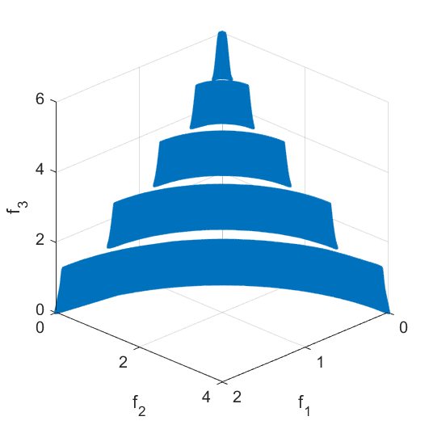

# RSG
Reference Set Generator

## What is it for?
- A **Reference Set Generator (RSG)** to obtain uniform and bias-free Pareto Front (PF) reference sets.
- Designed for use as reference set for the distance-based performance indicators such as GD (Generational Distance) and IGD (Inverted Generational Distance).

## Why use it?
- Uniform and bias-free reference sets are crucial to avoid misleading or incorrect performance indicator results.

## When to use it?
- When you have a **reasonably accurate approximation of the Pareto Front**, and you need a consistent reference set for evaluation.



---

### Major Components

1. **`RSG.m`**  
   The main Reference Set Generator implementation (Algorithm 1) as described in [[RWS25]](https://www.mdpi.com/2227-7390/13/10/1626).

2. **`Data/Py`**  
   Contains example starting sets `Py` for testing RSG on classic benchmark functions. Included functions:  
   `WFG2`, `CONV3`, `CONV3-4`, `CONV4-2F`, `ZDT1`, `ZDT3`, `DTLZ1`, `DTLZ2`, `DTLZ7`, `IDTLZ1`, `IDTLZ2`, `CDTLZ2`, and `C2-DTLZ2`.

3. **`Data/Clean_Multiple_Components/`**  
   Contains:
   - `run_RSG_load_components_DTLZ7.m`
   - `run_RSG_load_components_WFG2.m`  
   These scripts demonstrate how to handle triangle cleaning for disconnected Pareto Fronts (multi-component cases), including necessary dependencies.

---

## Installation

No special installation is required. `RSG.m` is self-contained. However, the following **Matlab toolbox is required**:

- `Statistics and Machine Learning Toolbox` (available since MATLAB R2019a)

---

## Recommended MATLAB Versions

This code has been tested and verified on:

- MATLAB **R2022b**
- MATLAB **R2023a**

Older versions may still work, but some functions like `dbscan` and `kmeans` require MATLAB R2019b or newer.

## Manual

The file `RSG_Manual.pdf` contains a manual describing detailed information on how to run RSG including examples on familiar test problems such as WFG2, DTLZ7, ZDT3, among others. 

# Usage

RSG can be called in MATLAB as follows:

```matlab
[Z, Iy] = RSG(Py, Nf, N, clean_method, threshold, epsInterval, eps_def, minptsInterval, trimming, endpoints, subsel);
```

---

## Arguments

| Argument         | Type            | Description |
|------------------|------------------|-------------|
| `Z`              | `matrix`         | The resulting reference set generated by RSG. |
| `Iy`             | `matrix`         | The filled set produced before trimming. |
| `Py`             | `matrix`         | The initial approximation of the Pareto Front (PF). |
| `Nf`             | `integer`        | Number of desired points in the filled set `Iy`. |
| `N`              | `integer`        | Number of desired points in the final reference set `Z`. |
| `clean_method`   | `string` or `[]` | **(Only for problems with k > 2 objectives)** Method used for triangle cleaning. Options: <br> &nbsp;&nbsp;• `'long'` (recommended): removes triangles with long edges. <br> &nbsp;&nbsp;• `'cond'`: uses the condition number of triangle vertices. <br> &nbsp;&nbsp;• `'area'`: removes large-area triangles. <br> &nbsp;&nbsp;• `'off'`: disables cleaning. <br> For bi-objective problems, use `clean_method = []`. |
| `threshold`      | `numeric` or `[]`| **(Only for k > 2)** Cleaning threshold. Triangles with metric values above this are discarded. <br> Use `[]` for bi-objective problems. |
| `epsInterval`    | `2-element vector` | Range `[a, b]` of radii for DBSCAN clustering. Used in grid search for component detection. |
| `eps_def`        | `numeric`        | Step size used in `epsInterval`. DBSCAN will scan `{a, a + eps_def, ..., b}`. |
| `minptsInterval` | `2-element vector` | Range `[a, b]` of minimum point values for DBSCAN clustering. |
| `trimming`       | `boolean (0 or 1)` | If `1`, reduces the filled set `Iy` to `Z` using the selected clustering method. If `0`, only returns the filled set. |
| `endpoints`      | `boolean (0 or 1)` | If `1`, includes endpoints in the final set `Z`. |
| `subsel`         | `string`         | Method used to select `N` points from `Iy`. Options: <br> &nbsp;&nbsp;• `'means'`: k-means clustering <br> &nbsp;&nbsp;• `'medoids'`: k-medoids clustering <br> &nbsp;&nbsp;• `'spectral'`: spectral clustering |

---

## Notes

- For bi-objective problems (`k = 2`), both `clean_method` and `threshold` must be set to `[]`.
- For multi-objective problems (`k > 2`), selecting an appropriate cleaning method and threshold is important for the uniformity of the reference set. See Section *2.3 Cleaning Parameters* of the `RSG_Manual.pdf` for instructions on how to find the correct values of `threshold`.
- For further discussion on selecting DBSCAN parameters, see Section *2.2 Component Detection Parameters* of the `RSG_Manual.pdf` or paper [[RWS25]].


## References

* [[RWS25]](https://doi.org/10.3390/math13101626) Rodriguez-Fernandez, A.E.; Wang, H.; Schütze, O. Reference Set Generator: A Method for Pareto Front Approximation and Reference Set Generation. Mathematics 2025, 13, 1626.